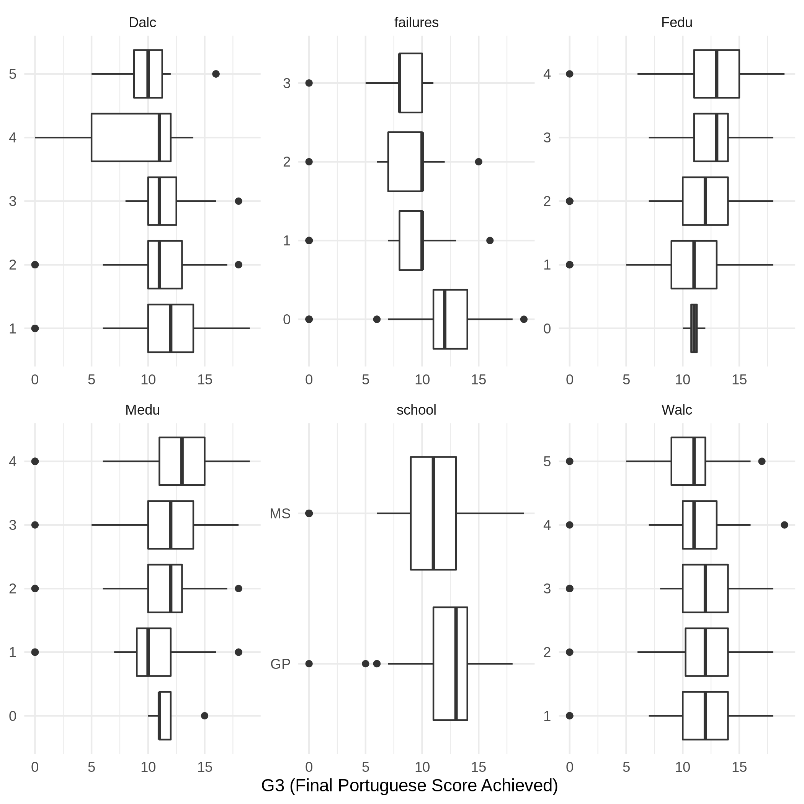

# DSCI522 Group 403 - Student Performance Report
```{r include=FALSE}
library(knitr)
library(tidyverse)
```

## Motivation & Data Set

Our selected data set summarizes Portuguese high school student's academic performance in both Math and Portuguese. For this project we are trying to answer the question: what are the top five features that most strongly predict high school student's performances in their Portuguese language course? In developing social initiatives to improve student scores, it could be immensely useful to understand what attributes play a strong role in predicting performance. Without identifying these key factors, such initiatives would likely be less effective and would fail to provide a high return on the school board or government's investment.

The data set was sourced from the UCI Machine Learning Repository [@CortezUCI] which can be found [here](https://archive.ics.uci.edu/ml/datasets/Student+Performance), and the original research paper [@Cortezetal] can be found [here.](http://www3.dsi.uminho.pt/pcortez/student.pdf) The data was compiled from official school reports as well as questionnaires provided to students. Attributes include the student grades, demographic, social and other school related features. Two datasets are provided regarding the performance in two distinct subjects: Mathematics (`mat`) and Portuguese language (`por`), though these datasets do not correspond to the same students. For the purpose of this analysis, we have decided to focus only on the Portuguese data set to investigate which student attributes are the strongest predictors of performance in that subject.

Some key highlights regarding the data set's attributes:

- The feature of interest is `G3` which represents the final subject grade score at the end of the academic year. The score ranges from 0 to 20. 
- Multi-categorical attributes such as family size (`famsize`), parent's education (`Fedu`/`Medu`) or weekly study time (`studytime`)
- Binary attributes such as home internet access (`internet`) or family educational support (`famsup`)
- Count attributes such as number of days of absence (`absences`)


## Exploratory Data Analysis

Before building our model, we partitioned the data into a training and test set (split 80%:20%) and performed exploratory data analysis to investigate the distribution of our predictive features and explore whether there are any highly correlated features we might want to omit from our analysis.

### Feature Correlations:


**Figure 1 - Feature Correlations**

As we can see from Figure 1, our target attribute `G3` has a strong correlation with attributes `G2` and `G1`. This occurs because `G3` is the grade issued at the end of the year, while `G1` and `G2` correspond to the grades for the 1st and 2nd school terms of that year. Though it will be more difficult to get accurate predictions without these features, it makes sense to drop them in light of our research question and motivations outlined above. We're more interested in which attributes, other than recent academic performance, will be most predictive of future academic performance.

### Variable Distributions:

 
**Figure 2 - Distribution Boxplots for Categorical & Binary Features**

Looking at the feature distribution boxplots in Figure 2, we can see that some of the most noteworthy features include student's past number of course failures (`failures`), parental education levels (`Medu`, `Fedu`), alcohol consumption on weekdays and the weekend (`Dalc`, `Walc`), and the school they attended (`school`). Each of these appears to show a clear trend with respect to G3, so we would expect to see some of these features having strong predictive power in the machine learning models we develop. 


**Figure 3 - Ridgeplot of Absences Feature **

Similarly, Figure 3 shows that lower `G3` scores have longer tails of `absences` counts, indicating this may be a useful predictive feature as well.


**Figure 4 - Distribution of Response Variable, G3**

Finally, our response variable G3 shows an approximately normal distribution, with a mean of 11.87 and a median of 12 out of 20. There are some outliers at the low end (students with a score of 0), which ends up pulling down the mean value slightly.

## Predictive Modelling

To answer the predictive question posed above, we built and compared several predictive regression models. We constructed the following models, optimizing each according to the specified hyperparameters. Model performance was evaluated using root mean squared error (RMSE).

A total of 5 models were chosen using Scikit Learn [@sklearn_api], XGBoost [@Chen:2016:XST:2939672.2939785], and Light GBM [@Ke2017LightGBMAH]:  

- Linear Regression with Lasso (L1)  
- Linear Regression with Ridge (L2)  
- Random Forest (L1)  
- XGBoost Regressor  
- LightGBM Regressor   

The choice for model types stem from the feature extraction functionalities that they provide, which suit our analysis of top predictors features. Linear regression models can output the weights of each feature, while tree models can output the feature importances according to the node splitting.

We applied the following preprocessing techniques for the data:

- Standard Scaling for numerical features
- One-Hot-Encoding for binary/categorical features.

Hyperparameters were tuned with the Bayesian Optimization package [@bayesopt] using 10 fold cross validation. For more details on the best hyperparameters for each model, please find the stored outputs in the [data outputs folder](../data/outputs/). The validation results for each model type is shown in the following:

```{r, echo = FALSE, warning = FALSE, message = FALSE}
cv_dat <- read_csv("../data/output/cv_results.csv")
colnames(cv_dat) <- c("Model", "cv_rmse_score")

kable(cv_dat)
```

Using the preprocessed test data, we scored all 5 of the tuned models. The test results for each tuned model type is as shown:

```{r, echo = FALSE, warning = FALSE, message = FALSE}
test_rmse_dat <- read_csv("../data/output/final_results.csv")
colnames(test_rmse_dat) <- c("Model", "test_rmse_score")

kable(test_rmse_dat)

best_score <- test_rmse_dat %>% head(1) %>% select(test_rmse_score) %>% pull()
```

Based on the results, the RandomForest model performed best with a RMSE of `r round(best_score, 3)`.


## Ranked Features & Conclusions

The top 10 ranked features from our Random Forest regression model were as follows:

 
**Figure 7 - Ranked Features for Random Forest Model**

For the most part, the results appear to be inline with our expectations based on the features identified during the EDA process. `failures` and `absences` are the clear leaders, while many of the other highly important features were noted during EDA. Figure 7 includes the top 10 features to illustrate that the subsequent 5 most important features follow closely in terms of their importance scores. 

To formally address our research question, the five most predictive features are:

1. failures (number of past class failures)
2. absences (number of school absences)
3. age (student's age)
4. Walc (weekend alcohol consumption)
5. school (student's school)

Given that we have identified attributes that are strongly predictive of academic performance, this information could now be used to develop social programs or initiatives intending to improve student's academic performance. Targeting these specific attributes is likely to improve the effectiveness of such programs and thereby provide better return on investment.

## Reflections & Next Steps

**Dropped features:** 

We dropped features `G1` and `G2` after our EDA with the intent of removing features based on recent academic performance. `Failures`, which ended up being our top predictor, is highly correlated with `G1` and `G2` and could perhaps be removed in subsequent analysis attempting to focus on non-academic predictive attributes.

**Math data set:** 

For this analysis, we focused on only one of two available student performance data sets. We looked at student performance in Portuguese, rather than Math. In the future it would be interesting to explore whether the same model features are strong predictors across both subjects, or whether different subjects are predicted better by different features. We would be curious to see if performance in Math is strongly predicted by the 'going out with friends' attribute, for example.

**Modelling assumptions:** 

In our analysis, we assumed the target variable “G3” as a fully continuous variable and treated the overall problem as a regression. However, this is not actually true. Indeed, the variable can take on discrete values from 0-20 and values such as 1.115 or 19.333 were not observed. 

One might then think to switch to rephrasing this problem as a multi-class classification instead. However, there is a clear ordering in the target variable and in particular, the distance between the predicted score G3 and the actual score is important. If we were to treat this as a classification problem, an error of predicting a G3 score of 5 for a true G3 of 20 would be viewed the same as an error of predicting a G3 score of 19 for the same student. This is also undesirable.

In truth, our problem is neither regression or classification. Our problem instead is that of ordinal regression, which can be viewed as a middle ground. We wish to predict discrete labels while still respecting the relative nature of the labels themselves. Thus, a huge improvement to our analysis would be to switch to a better framework more suited for such a response.

# References
