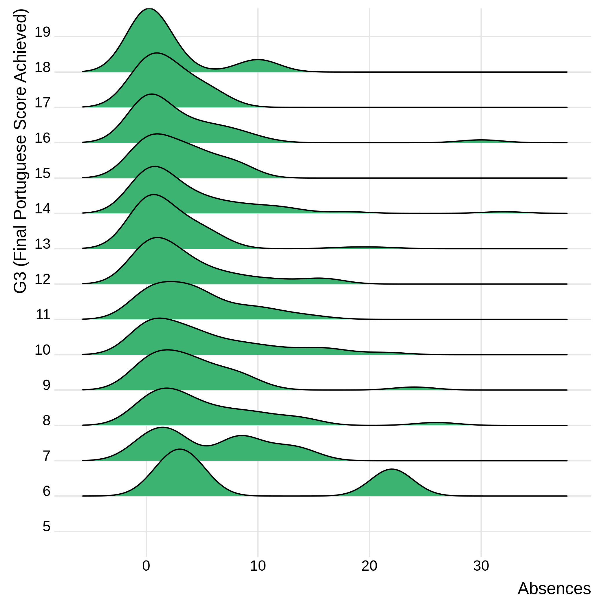
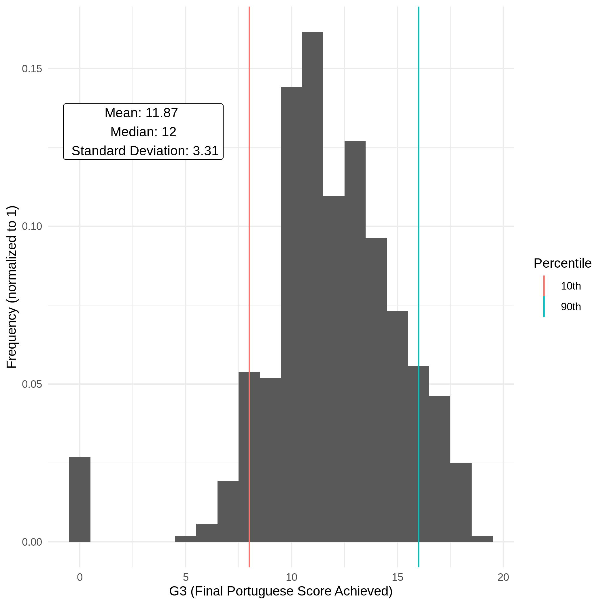
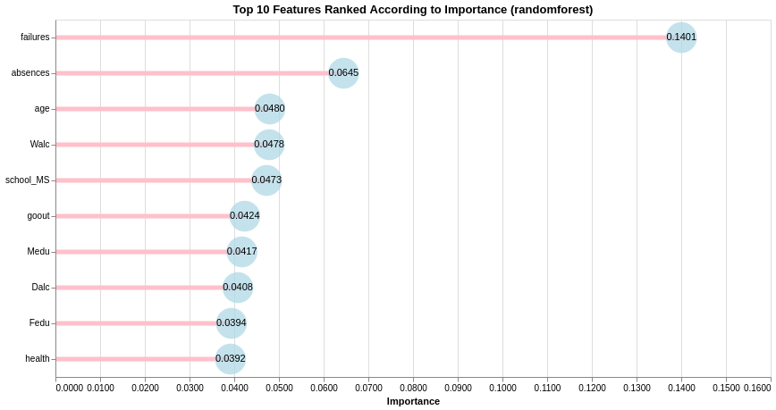

# DSCI522 Group 403 - Student Performance Report

## Motivation & Data Set

Our selected data set summarizes Portuguese high school student’s
academic performance in both Math and Portuguese. For this project we
are trying to answer the question: what are the top five features that
most strongly predict high school student’s performances in their
Portuguese language course? In developing social intiatives to improve
student scores, it could be immensely useful to understand what
attributes play a strong role in predicting performance. Without
identifying these key factors, such intiatives would likely be less
effective and would fail to provide a high return on the school board or
government’s investment.

The data set was sourced from the UCI Machine Learning Repository
(Cortez 2014) which can be found
[here](https://archive.ics.uci.edu/ml/datasets/Student+Performance), and
the original research paper (Cortez and Silva 2008) can be found
[here.](http://www3.dsi.uminho.pt/pcortez/student.pdf) The data was
compiled from official school reports as well as questionaires provided
to students. Attributes include the student grades, demographic, social
and other school related features. Two datasets are provided regarding
the performance in two distinct subjects: Mathematics (`mat`) and
Portuguese language (`por`). For the purpose of this analysis, we have
decided to focus only on the Portuguese dataset to investigate which
student attributes are the strongest predictors of performance in that
subject.

Some key highlights regarding the data set’s attributes:

  - The feature of interest is `G3` which represents the final subject
    grade score at the end of the academic year. The score ranges from 0
    to 20.
  - Multi-categorical attributes such as family size (`famsize`),
    parent’s education (`Fedu`/`Medu`) or weekly study time
    (`studytime`)
  - Binary attributes such as home internet access (`internet`) or
    family educational support (`famsup`)
  - Count attributes such as number of days of absence (`absences`)

## Exploratory Data Analysis

Before building our model, we partitioned the data into a training and
test set (split 80%:20%) and performed exploratory data analysis to
investigate the distribution of our predictive features and explore
whether there are any highly correlated features we might want to ommit
from our
analysis.

### Feature Correlations:

**Figure 1 - Feature Correlations**

As we can see from Figure 1, our target attribute `G3` has a strong
correlation with attributes `G2` and `G1`. This occurs because `G3` is
the grade issued at the end of the year, while `G1` and `G2` correspond
to the grades for the 1st and 2nd school terms of that year. Though it
will be more difficult to get accurate predictions without these
features, it makes sense to drop them in light of our research question
and motivations outlined above. We’re more interested in which
attributes, other than recent acadmemic performance, will be most
predictive of future academic performance.

### Variable Distributions:

 **Figure 2 - Distribution Boxplots for
Categorical & Binary Features**

Looking at the feature distribution boxplots in Figure 2, we can see
that some of the most noteworthy features include student’s past number
of course failures (`failures`), parental education levels (`Medu`,
`Fedu`), alcohol consumption on weekdays and the weekeend (`Dalc`,
`Walc`), and the school they attended (`school`). Each of these appears
to show a clear trend with respect to G3, so we would expect to see some
of these features having strong predictive power in the machine learning
models we
develop.

**Figure 3 - Ridgeplot of Absences Feature**

Similarly, Figure 3 shows that lower `G3` scores have longer tails of
`abscences` counts, indicating this may be a strong predictive feature
as
well.

**Figure 4 - Distribution of Response Variable, G3**

Finally, our response variable G3 shows an approximately normal
distribution, with a mean of 11.87 and a median of 12 out of 20. There
are some outliers at the low end (students with a score of 0), which
ends up pulling down the mean value slightly.

## Predictive Modelling

To answer the predictive question posed above, we built and compared
several predictive regression models. We constructed the following
models, optimizing each according to the specified hyperparameters.
Model performance was evaluated using RMSE.

**Figure 5**

**Figure 6**

We found that the RandomForest model performed best with a RMSE of xyz
(figure/table?).

#### TODO: Do we need to justify model choices more? simplified version of what tiffanys done below?

    Given that all measurements are continuous in nature, and the outcome we are trying to predict is one of two classes, one suitable and simple approach that we plan to first explore is using a k-nearest neighbours classification algorithm. 
    
    - With this algorithm, we will have to choose K, the number of nearest neighbours to use for prediction. 
    - We will choose K via cross-validation using ~ 30 folds because this Wisconsin Breast Cancer data set is not very large, having only 569 observations. We will use overall accuracy to choose K. 
    - A line plot of overall accuracy versus $K$ will be included as part of the final report for this project.

Table of CV dsscores from each model (kable), hyperlink to the full
hyperparameter outputs

## Ranked Features & Conclusions

The top 10 ranked features from our Random Forest regression model were
as follows:

 **Figure 7 - Ranked Features for
Random Forest Model**

For the most part, the results appear to be inline with our expectations
based on the features identified during the EDA process. `failures` and
`absences` are the clear leaders, while many of the other highly
important features were noted during EDA. Figure 7 includes the top 10
features to illustrate that the subsequent 5 most important features
follow closely in terms of their importance scores.

To formally address our research question, the five most predictive
features are:

1.  failures (number of past class failures)
2.  absences (number of school absences)
3.  age (student’s age)
4.  Walc (weekend alcohol consumption)
5.  school (student’s school)

Given that we have identified attributes that are strongly predictive of
academic performance, this information could now be used to develop
social programs or intitatives intending to improve student’s academic
performance. Targetting these specific attributes is likely to improve
the effectiveness of such programs and thereby provide better return on
investment.

## Reflections & Next Steps

#### TODO: Not using the right regression approach? Brayden notes

We dropped features `G1` and `G2` after our EDA with the intent of
removing features based on recent academic performance. `Failures`,
which ended up being our top predictor, is highly correlated with `G1`
and `G2` and could perhaps be removed in subsequent analysis attempting
to focus on non-academic predictive attributes.

For this analysis, we focused on only one of two available student
performance data sets. We looked at student performance in Portuguese,
rather than Math. In the future it would be interesting to explore
whether the same model features are strong predictors across both
subjects, or whether different subjects are predicted better by
different features. We would be curious to see if performance in Math is
strongly predicted by the ‘going out with friends’ attribute, for
example.

# References

Cortez, Paulo. 2014. “UCI Machine Learning Repository.” University of
California, Irvine, School of Information; Computer Sciences.
<http://archive.ics.uci.edu/ml>.

Cortez, P., and A. Silva. 2008. “Using Data Mining to Predict Secondary
School Student Performance.” In *Proceedings of 5th Future Business
Technology Conference*, edited by A. Brito and J. Teixeira, 1905:5–12.
FUBUTEC. <https://doi.org/978-9077381-39-7>.

